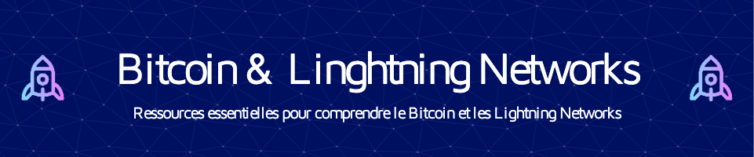

# Bitcoin & Lightning Network `Francophone` Ressources HUB

#### Disponible en 2 versions || [Anglais](https://github.com/richarddushime/BLN-EduHub-Francophone/blob/main/README-en.md) et [Francais](https://github.com/richarddushime/BLN-EduHub-Francophone/blob/main/README.md) ||

## Idea: 
Francophone Bitcoin & Lightning Network Educational Hub

## Problem:
French-speaking communities lack sufficient resources and communities dedicated to understanding and utilizing Bitcoin and the Lightning Network.

## Solution:
Create a dedicated educational platform exclusively designed for individuals in French-speaking communities who are interested in Bitcoin and the Lightning Network. The primary objective is to offer easily accessible and simplified educational content, fostering comprehension and encouraging widespread adoption. Additionally, curate a comprehensive repository of resources available in French, encompassing articles, journals, books, etc. This initiative aims to serve as the go-to source for guidance and direction for anyone within the French-speaking Bitcoin community, providing a centralized hub for valuable information and support.

## Key Features:

1. French Content Hub:  Create a centralized  Repository with comprehensive educational content, tutorials,Webinars and Workshops and articles in French. Cover topics ranging from the basics of Bitcoin and Lightning Network to more advanced concepts.

2. Community Forums: Develop an online forum for French speakers to discuss, share experiences, and ask questions. This community-driven platform can serve as a space for networking and mutual support.

3. Translation Services:  Provide translations of key Bitcoin and Lightning resources, and documentations into French to bridge language barriers and make knowledge more accessible.

## Why its Important:

- Addresses the specific linguistic and educational needs of French-speaking communities.
- Simplifies complex concepts for a broader audience.
- Fosters a sense of community through online and offline interactions, catering to diverse learning preferences.

By focusing on education and community building, We aim to empower French speakers with the knowledge and tools to actively participate in the Bitcoin and Lightning Network ecosystems. This initiative contributes to the global inclusivity of the cryptocurrency space.

Welcome and join us in making a meaningful contribution! Click [Contributing Guidelines](https://github.com/richarddushime/BLN-EduHub-Francophone/blob/main/CONTRIBUTING.md) to explore our guidelines for contributing. We value your input and look forward to collaborating with you.

> We express our sincere gratitude to [`Btrust Builders`](https://builders.btrust.tech/) for their unwavering support and commendable efforts in advancing the Bitcoin space within the African continent. "Btrust Builders" stands as a pioneering program dedicated to nurturing the next wave of Bitcoin and Lightning Network developers across Africa. The initiative is driven by the aim to discover, enhance skills, and connect African developers with Bitcoin companies worldwide, contributing significantly to the growth and expertise within the global Bitcoin ecosystem.

## Recent Contributions Map

