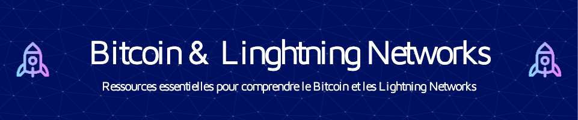

## 

**Available in 2 Versions || [English](https://github.com/richarddushime/BLN-EduHub-Francophone/blob/main/README-en.md) and [French](https://github.com/richarddushime/BLN-EduHub-Francophone/blob/main/README.md) ||**

## Idée:
Centre éducatif francophone Bitcoin & Lightning Network

## Problème:

Les communautés francophones manquent de ressources suffisantes et de communautés dédiées à la compréhension et à l’utilisation du Bitcoin et du Lightning Network.

## Solution:

Créer une plateforme éducative dédiée, exclusivement conçue pour les individus des communautés francophones qui s'intéressent à Bitcoin et au Lightning Network. L'objectif principal est d'offrir un contenu éducatif facile d'accès et simplifié, afin de favoriser la compréhension et d'encourager l'adoption à grande échelle. En outre, un répertoire complet de ressources disponibles en français, comprenant des articles, des revues, des livres, etc. est mis à disposition. Cette initiative a pour but de servir de source d'orientation et de conseils pour tous les membres de la communauté francophone de Bitcoin, en fournissant un centre centralisé d'informations et de soutien précieux.

## Principales caractéristiques:

1. Centre de contenu français : créez un référentiel centralisé avec un contenu éducatif complet, des tutoriels, des webinaires, des ateliers et des articles en français. Couvrez des sujets allant des bases de Bitcoin et Lightning Network à des concepts plus avancés.

3. Forums communautaires : Développer un forum en ligne pour les francophones pour discuter, partager leurs expériences et poser des questions. Cette plateforme communautaire peut servir d’espace de réseautage et de soutien mutuel.

5. Services de traduction : fournissez des traductions des ressources et de la documentation clés de Bitcoin et Lightning en français pour surmonter les barrières linguistiques et rendre les connaissances plus accessibles.

## Pourquoi c'est Important :

- Répond aux besoins linguistiques et éducatifs spécifiques des communautés francophones.
- Simplifie les concepts complexes pour un public plus large.
- Favorise un sentiment de communauté à travers des interactions en ligne et hors ligne, répondant à diverses préférences d'apprentissage.

En se concentrant sur l’éducation et le renforcement de la communauté, cette plateforme vise à doter les francophones des connaissances et des outils nécessaires pour participer activement aux écosystèmes Bitcoin et Lightning Network et contribue également à l’inclusivité mondiale de l’espace des crypto-monnaies.

Bienvenue et rejoignez-nous pour apporter une contribution significative ! Cliquez sur [Directives de contribution](https://github.com/richarddushime/BLN-EduHub-Francophone/blob/main/CONTRIBUTING.md) pour découvrir nos directives de contribution. Nous apprécions votre contribution et sommes impatients de collaborer avec vous.

> Nous exprimons notre sincère gratitude à [`Btrust Builders`](https://builders.btrust.tech/) pour leur soutien indéfectible et leurs efforts louables visant à faire progresser l’espace Bitcoin sur le continent africain. `« Btrust Builders »` est un programme pionnier dédié à nourrir la prochaine vague de développeurs Bitcoin et Lightning Network à travers l'Afrique. L'initiative est motivée par l'objectif de découvrir, d'améliorer les compétences et de connecter les développeurs africains avec les sociétés Bitcoin du monde entier, contribuant ainsi de manière significative à la croissance et à l'expertise au sein de l'écosystème mondial Bitcoin.

## Carte des contributions récentes

